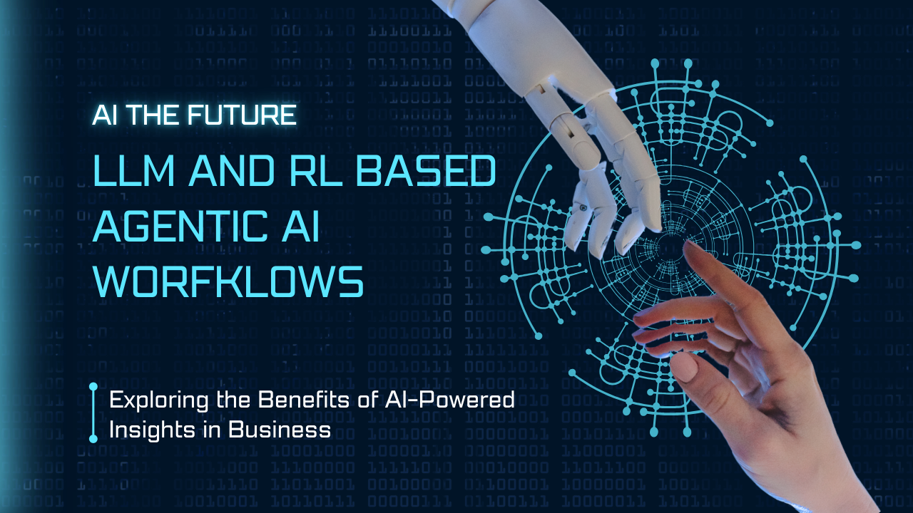

  

  
  

# 🌟 Wharf AI Sales Agent

This notebook implements an LLM and Reinforcement-learning-based AI sales agent for popular e-commerce platforms like Shopify, Woocommerce, etc.
The system includes:

-   Real-time behavioral tracking

-   Proactive customer engagement

-   Product recommendations

-   Conversation management

-   Platform-specific integrations

## 📂 Featured Paper
- [💼 Deep Learning Application in Sales Automation and Customer Experience Personalization in SMBs: A Hybrid Approach Using Transformer-Based LLMs and RL](https://www.ijisme.org/portfolio-item/a132113010125/)

